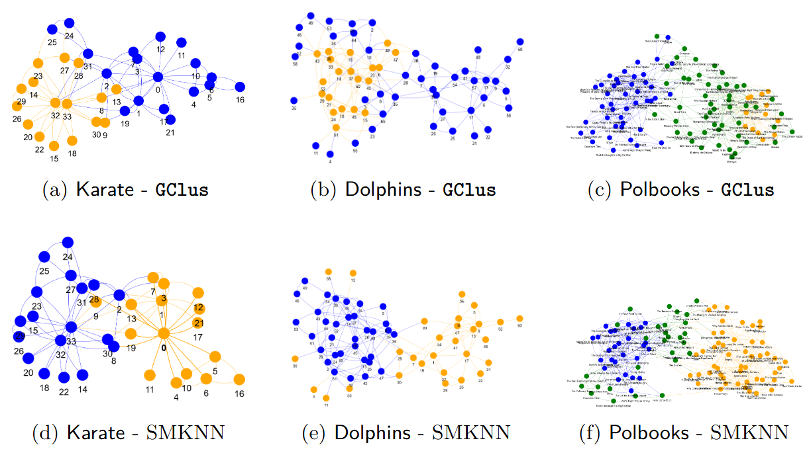
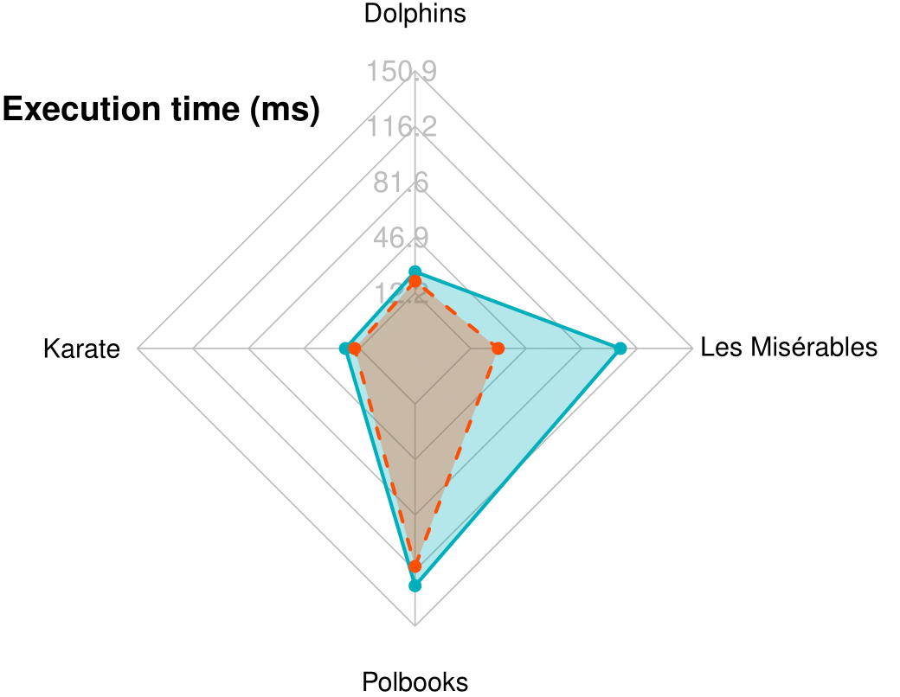
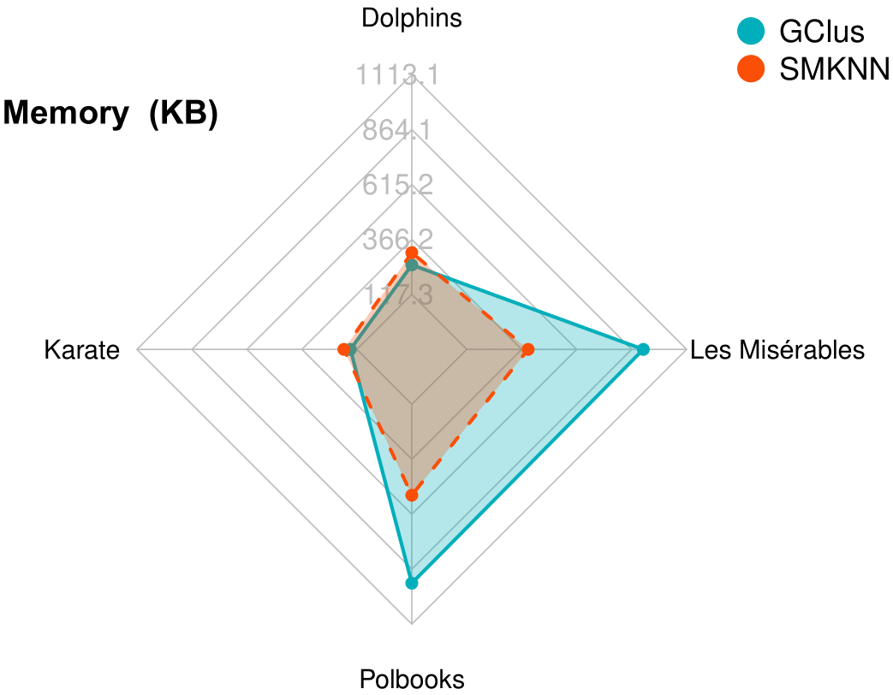

# GClus: Enforcing Explicit Size Constraints in Graph Clustering through Structural Refinement

## Overview

This repository contains the experimental materials and supplementary documentation for the paper:

**GClus: Enforcing Explicit Size Constraints in Graph Clustering through Structural Refinement**

GClus is a graph clustering algorithm that integrates strict, user-defined size limits into the community detection process. It combines structural metrics (k-truss, clique density, and conductance) with iterative split-and-merge refinements to ensure that communities remain both structurally cohesive and balanced in size.

---

## A) Datasets

To evaluate GClus, we employ a diverse collection of graph benchmarks. For real-world data, we consider well-known networks such as Dolphins<sup>1</sup>, Karate<sup>2</sup>, Polbooks<sup>3</sup>, and Les Misérables<sup>4</sup>. These networks provide established ground truths or meaningful community divisions that are commonly used for clustering evaluation:

### Real-World Networks

- **Dolphins**  
  Originally introduced by Lusseau et al. <sup>1</sup>, the Dolphins network captures the association patterns among 62 bottlenose dolphins. Comprising 159 undirected edges, this network exemplifies a social system with moderate sparsity and clearly defined subgroups. The ground truth for this dataset (typically representing two communities) provides an established benchmark for evaluating clustering performance in terms of both adherence to size constraints and community cohesiveness.

- **Karate Club**  
  The Karate club network, first documented by Zachary<sup>2</sup>, models the social interactions among 34 members of a karate club. With 78 edges connecting the nodes, this dataset is renowned for its distinct bifurcation into two communities. Despite its relatively small size, the Karate network poses a significant challenge due to the presence of overlapping attributes and varied interaction strengths, making it an ideal candidate for testing the precision and stability of size-constrained clustering approaches.

- **Polbooks**  
  Based on co-purchasing patterns of books on politics as described in <sup>3</sup>, the Polbooks network contains 105 nodes and 441 edges. The denser structure and the presence of three naturally occurring communities test the ability of clustering algorithms to balance between high internal connectivity and strict size restrictions. This dataset is particularly useful for understanding how the algorithm scales with increasing edge density and more complex community arrangements.

- **Les Misérables**  
  This dataset is derived from the character co-occurrence network in Victor Hugo’s *Les Misérables*<sup>4</sup>. With 77 nodes and 254 edges, the graph offers a unique environment due to its literary origin. Unlike the previous datasets, *Les Misérables* is sourced through the Python NetworkX package, and it does not come with weights or explicit ground truth community labels. This presents a scenario where clustering must be performed on a dynamically constructed network from textual data, challenging the algorithm’s adaptability and robustness in less structured settings.

### Synthetic Networks

Synthetic benchmarks were generated with explicit size restrictions to test the robustness of GClus under varying densities and geometries.

- **Aggregation** – A benchmark network modeling a clear aggregation phenomenon with communities that form distinct clusters, despite some uneven group sizes.  
- **Bridge** – This dataset consists of two densely connected clusters linked by a weak bridge of edges, providing a clear test case for size-constrained merging and splitting.  
- **Compound** – A more challenging synthetic network featuring multiple communities with varying interconnectivity, useful for evaluating the robustness of our refinement steps.  
- **Flame** – Composed of two groups that exhibit a flame-like spatial distribution, this dataset tests the algorithm’s ability to respect somewhat irregular group shapes.  
- **Jain** – A classic benchmark consisting of two well-separated communities in the form of moons.  
- **Spiral** – A synthetic instance with three clusters arranged in a spiral pattern, challenging the algorithm to partition intertwined groups while enforcing size constraints.  
- **Two Diamonds** – A network with two “diamond”-shaped communities, exemplifying clear intra-cluster concentrations with a hard cardinality requirement.  
- **Sticks** – This instance consists of three communities with stick-like structures, where connectivity is more elongated and enforcing precise group sizes is nontrivial.  
- **Five Cluster** – A more complex synthetic dataset featuring five distinct groups with a wide range of sizes, highlighting the algorithm’s ability to scale to numerous communities.  
- **Noisy Circles** – This dataset is based on circular clusters with added noise, representing a scenario in which the intrinsic community structure is less clear and size constraints must guide the partitioning.

---

## B) Experimental Environment

All experiments were conducted on a dedicated workstation to ensure reproducibility and accurate performance evaluations. The hardware configuration consisted of an Intel Core i7-10510 CPU with 8 physical cores clocked at up to 4.9 GHz, 12 GB of DDR4 RAM, and a 1 TB NVMe solid-state drive.  For software, we used Python 3.12 as the primary programming language, taking advantage of its extensive ecosystem for numerical computing and network analysis. The experimental framework was set up within a Conda environment (version 24.9.1) to ensure dependency management and reproducibility. Key Python libraries included NetworkX for graph manipulation, NumPy for efficient numerical computations, and SciPy for optimization routines. The algorithmic implementations, such as the community extraction, refinement, and balancing modules of GClus, were thoroughly tested using this environment, ensuring consistent performance across multiple runs.

To monitor execution times and memory usage, we incorporated profiling tools (e.g., Python’s built-in `time` module and `memory_profiler`) into our evaluation pipeline. Execution times were measured in milliseconds, and memory consumption was tracked in kilobytes throughout the application’s runtime.  This enabled us to capture detailed performance metrics under various experimental configurations.

In order to replicate the experimental environment and reproduce the results, the following setup procedure is provided. It details the required dependencies, installation steps, and testing commands used during the evaluation process.

## _**Dependencies**_  
Libraries: networkx, matplotlib, scikit-learn, pymetis, pyvis.  

## _**Installation**_  
1. Install [Miniconda3](https://docs.anaconda.com/miniconda/). During installation, check the option to add conda to the PATH; installation for Windows systems.  
2. Install Miniconda3 for Linux systems using the following commands:  
   ```sh
   apt update -y
   apt upgrade -y
   wget https://repo.anaconda.com/miniconda/Miniconda3-latest-Linux-x86_64.sh
   bash Miniconda3-latest-Linux-x86_64.sh
   source ~/miniconda3/bin/activate
   conda init
   ```
3. Verify the correct installation of Miniconda3.  
   ```sh
   conda --version
   ```
4. Open the terminal in the project's root folder and run the following commands:  
   ```sh
   pip install networkx
   pip install matplotlib
   pip install scikit-learn
   pip install pyvis
   conda update conda
   conda install conda-forge::pymetis
   ```
## _**Algorithm Testing**_  
1. From the root folder, the clustering algorithm can be tested on both Windows and Linux systems using:  
   ```sh
   python test.py
   ```
---

## C) Cluster Structures

In Figure 2 we show the cluster structures obtained by the two algorithms (GClus and SMKNN) on the real-world networks (Table 1).

<div align="center">
  
  <br>
  <sub><b>Fig. 2.</b> Comparison of nodes grouped by the clustering algorithms GClus (first row) and SMKNN (second row) for Karate, Dolphins, and Polbooks graphs.</sub>
</div>

---

## D) Execution Time and Memory Usage

For the real-world datasets (see Table 2 and Figure 3), our experiments reveal that GClus’s additional operations—such as iterative split-and-merge refinement and node adjustment—introduce a modest overhead in both execution time and memory usage compared to SMKNN.  For example, on the Karate and Dolphins networks, while the overall runtime difference is within a few milliseconds (e.g., GClus takes roughly 24–27 ms as opposed to SMKNN’s 16–25 ms), GClus tends to use slightly less or comparable memory due to its targeted local adjustments that prevent unnecessary global computations. In larger and more complex instances such as Polbooks and *Les Misérables*, even though GClus’s iterative refinement phase increases its overall runtime and memory consumption (with execution times differing by roughly 10–30 ms and memory usage showing similar moderate increases), the cost remains in a competitive range with SMKNN.  

For synthetic datasets, where graphs are typically larger or exhibit more challenging community structures, the computational impact of enforcing size constraints becomes more pronounced.  In datasets like Compound, Five Cluster, or Spiral, GClus’s iterative balancing requires additional passes that can roughly double the execution time compared to SMKNN.  The memory overhead in these cases also increases, as GClus must maintain extra intermediate structures during the split-and-merge process; however, this increase is generally linear with the graph size and acceptable given the added benefit of strict size conformity.  

Overall, while GClus demonstrates slightly higher computational demands on complex synthetic instances, its runtime and memory footprint remain competitive—especially when the application’s priority is on achieving balanced, size-constrained clusters.

<table>
  <tr>
    <td align="center" width="50%">
      <br>
      <sub><b>Fig. 3a.</b> Execution time (ms).</sub>
    </td>
    <td align="center" width="50%">
      <br>
      <sub><b>Fig. 3b.</b> Memory (KB).</sub>
    </td>
  </tr>
</table>

---
<sup>1.</sup> **Dolphins:** Lusseau, D., Schneider, K., Boisseau, O.J., Haase, P., Slooten, E., Dawson, S.M.: 
The bottlenose dolphin community of doubtful sound features a large proportion of long-lasting associations: can geographic isolation explain this unique trait?
Behavioral Ecology and Sociobiology 54, 396–405 (2003)

<sup>2.</sup> **Karate:** Zachary, W.W.: An information flow model for conflict and fission in small groups.
Journal of anthropological research 33(4), 452–473 (1977)

<sup>3.</sup> **Polbooks:** Newman, M.E.: Modularity and community structure in networks. 
Proceedings ofthe national academy of sciences 103(23), 8577–8582 (2006)

<sup>4.</sup> **Les Misérables:** Cardel´us, J., Serrano, J., Mateo, J.: gsbm: Generalized Stochastic Block Model for Network Data (2023), 
https://cran.r-project.org/web/packages/gsbm/vignettes/les miserables.html, 
r package version 0.1.0


